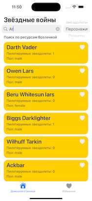
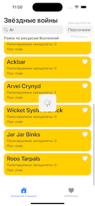

# SWTracker

Приложение позволяет искать ресурсы из фильмов серии Star Wars (Звездные войны) и сохранять их в Избранном. Также есть возможность просмотра детальной информации по выбранному ресурсу. Для получения данных используется открытый API SWAPI [https://swapi.dev/api/](https://swapi.dev/api/)

   

В настоящий момент реализован MVP с функционалом поиска ресурсов и отображением карточек с краткой информацией по ним. Планирую реализовать механизм добавления ресурсов в избранное и сам экран избранного. Информация о ресурсах, добавленных в избранное будет храниться локально. Также будет разработан экран с детальной информацией по выбранному ресурсу.

В приложении реализовано:

- Домашний экран с функционалом поиска (пока без добавления в избранное)

В приложении будет реализовано:

- Функционал добавления в избранное
- Экран Избранное со списком избранных ресурсов
- Экран с детальной информацией по выбранному ресурсу